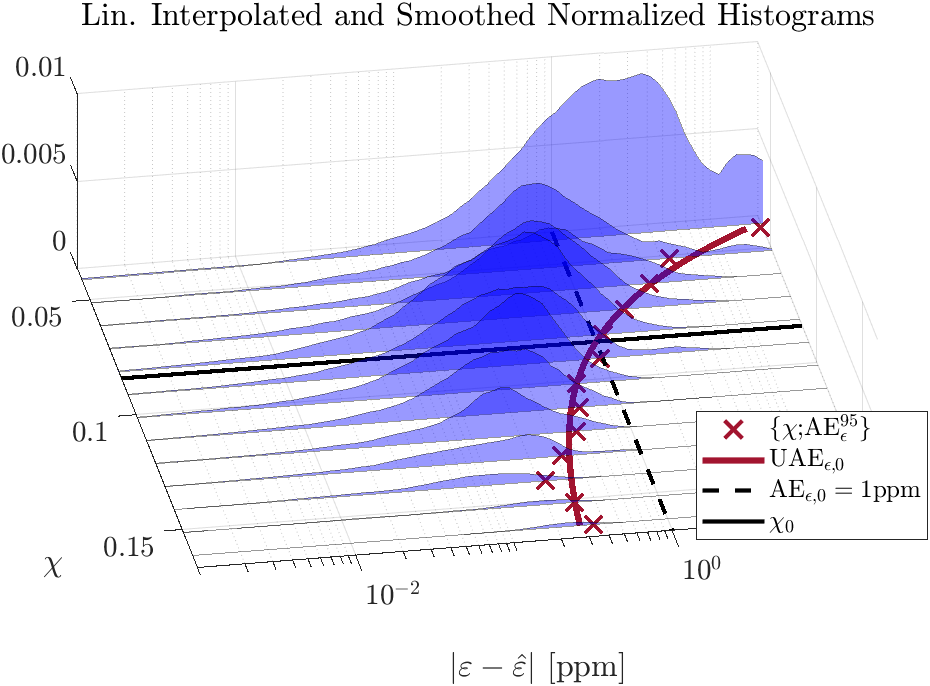
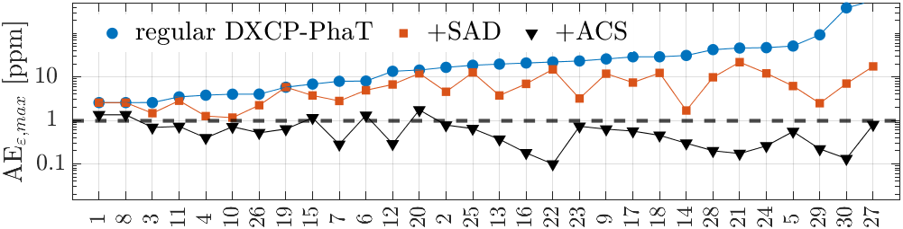
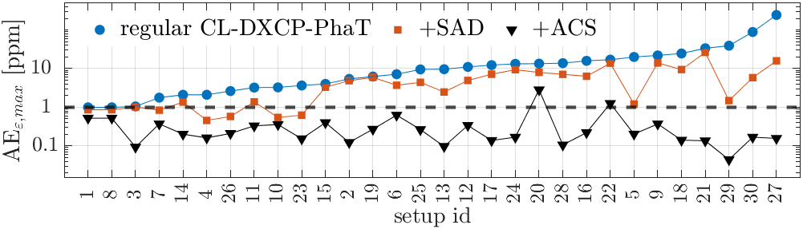

# LTSforWASN

MATLAB code used for production of published results in the paper **Long-Term Synchronization Of Wireless Acoustic Sensor Networks With Nonpersistent Acoustic Activity Using Coherence State**, written by Aleksej Chinaev, Niklas Knaepper and Gerald Enzner.

This repository is comprised of 4 primary scripts, each one corresponding to one of the following steps:
1. Generate a database of asynchronous signals
2. Estimate the sampling rate offset (SRO) and preliminary acoustic coherence state (ACS)
3. Render the bivariate histogram and infer the threshold required to obtain the final ACS
4. Evaluate SRO estimates obtained with and without ACS support

## 1 Downloads
### 1.1 Clean speech signal database
Althogh the [TIMIT Acoustic-Phonetic Continuous Speech Corpus](https://catalog.ldc.upenn.edu/LDC93s1) was used internally during development and for the published results, the code in this repository was adjusted for compatibility with the [LibriSpeech ASR corpus](https://www.openslr.org/12) to eliminate any licensing concerns. 

Please download the development set "clean" speech [here](https://www.openslr.org/resources/12/dev-clean.tar.gz) and place it inside the `audio/` directory if you wish to generate your own databases (see 3.1).


### 1.2 Asynchronous signal database
Exemplary training and test databases are available [here](#). Place both directories inside the `databases/` directory. Databases contain the simulated asynchronous signals. In addition, you can find the results for step 2 in `2023_11_15_13_38_48/results/est_results.mat` and the results for step 4 in `2023_11_16_12_19_41/results/eval_results.mat`.

Note that, due to the aforementioned circumstances, you will not be able to precisely reproduce the published results.


## 2 Configuration
Paths are configured globally with `Config.m`. This includes the root path for audio source signals and all databases, as well as the specific paths to the training and test database. By default, the latter point to the databases provided by us (see 1.2). 


## 3 Executing the scripts

You can find all primary scripts inside the `work/` directory.

### 3.1 Generate database
The script `i_generate_database.m` is used to generate a database of asynchronous signals for nodes in a simulated shoebox environment. The database is encapsulated in a directory named according to the current date-time and stored in the root path specified in `Config.m`. 

Note that you generally need two databases: The training database is used in step 2 and 3 to ultimately infer the threshold required for obtaining the ACS based on the preliminary quantity. To evaluate the performance of SRO estimation with ACS support when this threshold is employed in step 4, we utilize the separate test database.

The following summarizes the most important configurable parameters:

| Parameter | Description |
| --- | ---|
| sigLen_s | Overall signal length in seconds |
| T60_ms | Reverberation time in milliseconds |
| SRO_ppm_range | Interval of SRO values (in ppm) from which a random value will be drawn for every simulated geometry. |
| SNR_dB_selfNoise | Signal to noise ratio (SNR) of microphone self noise
| SNR_dB_diffuseNoise_range | Interval of SNR values for diffuse noise from which a random value will be drawn for every simulated geometry.
| n_setups | Number of setups (aka geometries) simulated.

### 3.2 Estimate SRO and preliminary ACS
After the database is created, SRO and preliminary ACS estimation is carried out in `ii_estimate_SRO_and_pACS.m`. Remember to update the paths for test and training database in `Config.m` if you are not using the provided data but instead created your own in 3.1.

This script requires no further configuration and can be executed as-is. The results will be stored in `databases/<training-database>/results/est_results.mat`.

### 3.3 Render bivariate histogram and infer threshold
In `iii_ACS_SRO_Est_err_PercentileFit.m`, the previously generated SRO and pACS data is used to first compute the absolute SRO estimation for each geometry and finally render the bivariate histogram of all estimation error and pACS values.

This script requires no further configuration and can be executed as-is. No results are stored. The employed threshold for obtaining the ACS is configured elsewhere.

&emsp;
<div align="center">

</div>
&emsp;

### 3.4 Evaluate 
Finally, the performance of ACS supported SRO estimation is evaluated in `iv_evaluate.m` using the test database. While this script generally requires no further configuration, you can choose to evaluate only the open-loop DXCP-PhaT SRO estimation in order to significantly reduce the execution time:

| Parameter | Description |
| --- | --- |
| include_CL_DXCPP | Whether or not to include closed-loop DXCP-PhaT SRO estimation in evaluation. Set to 1 or 0.

&emsp;
<div align="center">


</div>
&emsp;

*Please note: The evaluation results displayed here were generated based on the database created using libri-speech source signals (see 1.2), but using the original threshold $\chi_0$ from the publication, as inferred from other data used during internal development. Since the databases are of limited size, some fluctuations in results are to be expected. Specifically, we observe a slightly higher threshold when fitting the exponential curve on the bivariate histogram with data based on the libri-speech corpus. Employing this higher threshold, performance is overall still good, but suffers in some scenarios. Generally, some adjustsments may be needed when working with different type of source audio. For example, one might use 90th percentiles to fit the exponential curve, instead.*

## 4. Acknowledgment
This work was partially supported by [German Research Foundation (DFG)](https://asn.uni-paderborn.de/) - Project 282835863.


## 5. Related publications

```BibTex
@InProceedings{Chinaev2023longterm,
  author    = {Chinaev, A. and Knaepper, N. and Enzner, G.},
  booktitle = {Proc. IEEE Int. Conf. Acoust., Speech, Signal Process.},
  title     = {Long-term Synchronization of Wireless Acoustic Sensor Networks with Nonpersistent Acoustic Activity using Coherence State},
  year      = {2023},
  month     = {June},
  pages     = {1--5},
  doi       = {10.1109/ICASSP49357.2023.10095792}
} 
```

```BibTex
@InProceedings{Chinaev2022distributed,
   author    = {Chinaev, A. and Enzner, G.},
   booktitle = {Proc. Int. Workshop Acoust. Signal Enhancement},
   title     = {Distributed Synchronization for Ad-Hoc Acoustic Sensor
Networks Using Closed-Loop Double-Cross-Correlation Processing},
   year      = {2022},
   month     = {Sep.},
   pages     = {1--5}
}
```

```BibTex
@InProceedings{Chinaev2021control,
   author    = {Chinaev, A. and Wienand, S. and Enzner, G.},
   booktitle = {Proc. IEEE Int. Conf. Acoust., Speech, Signal Process.},
   title     = {Control Architecture of the Double-Cross-Correlation
Processor for Sampling-Rate-Offset Estimation in Acoustic Sensor Networks},
   year      = {2021},
   month     = {June},
   pages     = {801--805}
}
```